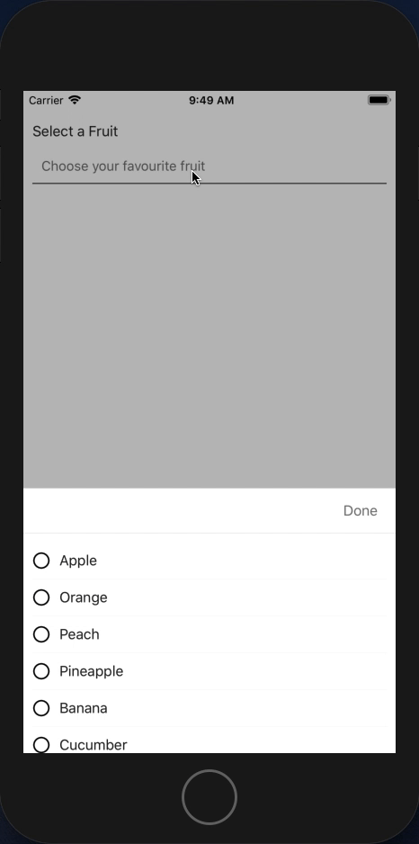

# React Native Form Select Picker _(v 0.0.6)_
This is a customized select picker that renders the same way on all platforms **(If you, however, want the native experience on iOS; set `showIOS` to be `true`)**.

## What's new?
Version 0.0.6 added a new feature:

- rendering of iOS native picker when `showIOS` is set to true. _(this is due to the latest rejection of apps by iOS due to non-iOS experience)_

if you already have this package in your project update to the 
latest version by running:
> `npm install --save react-native-form-select-picker@latest`

## Why react-native-form-select-picker?
The reason why I started this project is because react native default Picker becomes messed up when used on iOS devices
and I wanted somthing that works and renders the same on both iOS and Android.

## Look and feel
Here is the rendered sample of this package on android/iOS



## Installation
To install this package you will have to run the command below using npm
> `npm install --save react-native-form-select-picker`

We dont have an npm link yet. We will update that as soon as we get one.

## Usage
This module has been made to conform to the basic react native Picker in order to easily change import 
without having to change much on your code-base. We are developer friendly! :D
```javascript
import React, { Component } from 'react';
import SelectPicker from 'react-native-select-picker'; // Import the package
...

export default class YourClass extends Component {
	...

	render() {
		return (
			...

			<SelectPicker
				onValueChange={(value) => {
					// Do anything you want with the value. 
					// For example, save in state.
					this.setState({
						selected: value
					})
				}}
				selected={this.state.selected}
				>
				...
				<SelectPicker.Item label="Apple" value="apple" />	
				<SelectPicker.Item label="Banana" value="banana" />	
				<SelectPicker.Item label="Orange" value="orange" />	
				...
			</SelectPicker>

			...
		)
	}

	...
}
```

## Properties
### \<SelectPicker> component props
The following properties can go in the \<SelectPicker> component (equivalent of \<select> in HTML):

| Props | Type | Default | Required | Description |
|:-----:|:----:|:-------:|:--------:|:-----------:|
| **onValueChange** | function: (value: any, index: number) | N/A | Yes | This is a callback function that is to be used in getting the selected value; You can set a state from here.|
| **selected** | any | null | Yes | The selected value inserted as a property. Can be used to define default selection. |
| dismissable | boolean | true | No | If dismissable is set as `true`, the select modal can be closed by clicking outside the modal or pressing the back button (on `android`) |
| showIOS | boolean | false | No | Enables the native ios picker when set to `true` |
| disabled | boolean | false | No | When set to `true` component will behave like other disabled input components. i.e. click/press will not work. |
| placeholder | string | "" | No | This is the label that is shown when no option has been selected |
| placeholderStyle | StyleSheet | `{fontSize: 15, color:'#757575'}` | No | This is the style of the placeholder text. You can customize how the placeholder text looks before an option is being selected |
| onSelectedStyle | StyleSheet | `{fontSize: 16, color:'#252525'}` | No | This is the style to apply to the text label upon selection of an option |
| style | StyleSheet | `{padding:10}` | No | This it the style of the select box itself. Customize to fit your form. |
| containerStyle | StyleSheet | `{backgroundColor:'#FFFFFF'}` | No | This is the style for the modal dropdown select page. |
| doneButtonText | string | `"done"` | No | You can change the text being displayed for the confirmation button at the top right corner |
| doneButtonTextStyle | StyleSheet | `{textAlign:'center',color: '#1976D2',fontWeight: '600',fontSize:16}` | No | You can change the style of the confirm text to suit your design structure or template |

### \<SelectPicker.Item> component props
The following properties go into the \<SelectPicker.Item> component (equivalent of \<option> in HTML):

| Props | Type | Default | Required | Description |
|:-----:|:----:|:-------:|:--------:|:-----------:|
| **label** | string | `""` | Yes | This is the option label. It replaces the placeholder when an item is selected. |
| **value** | any | null | Yes | The value of the option is passed in here and it is the value passed to the `onValueChange` function. |

## Changelog
- 0.0.6: Added `showIOS` prop to enable or disable native iOS picker. _(iOS reviewers give high preference to the iOS native picker while reviewing to reject or accept an app)_
- 0.0.5: RN ^0.60 breaking changes fixed and iOS picker item select icon bug fixed. (Now showing the select icon)
- 0.0.4: Bug fixes in children re-render on update, IntelliSense and iOS UI fix.


## Contributing
This project was started by [Olayinka Okewale](https://github.com/olayinkaokewale)
on 20th April, 2019. If you'd love to contribute to this project, contact me on
[okjool2012@gmail.com](mailto:okjool2012@gmail.com)

## Support Us
If you like this project please give a star and follow me on my social media networks.

[](https://www.linkedin.com/in/olayinkaokewale)
[](https://www.instagram.com/olayinkaokewale)
[](https://www.twitter.com/olayinkaokewale)

